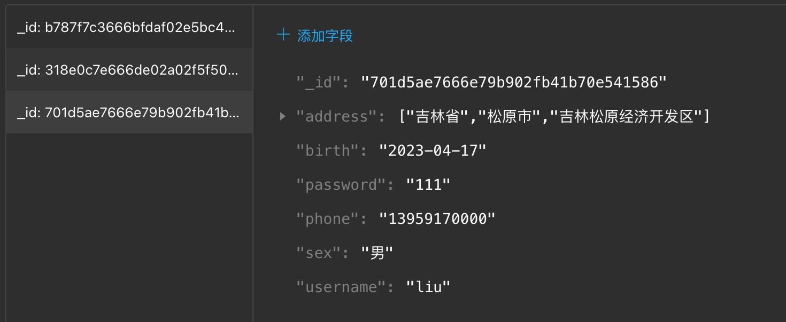
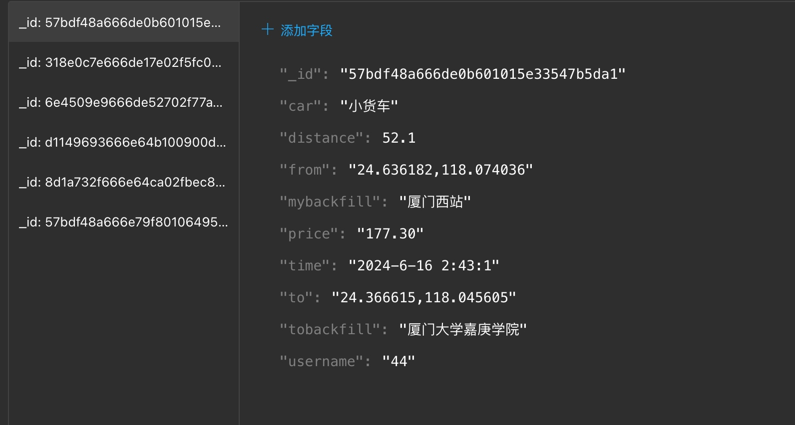
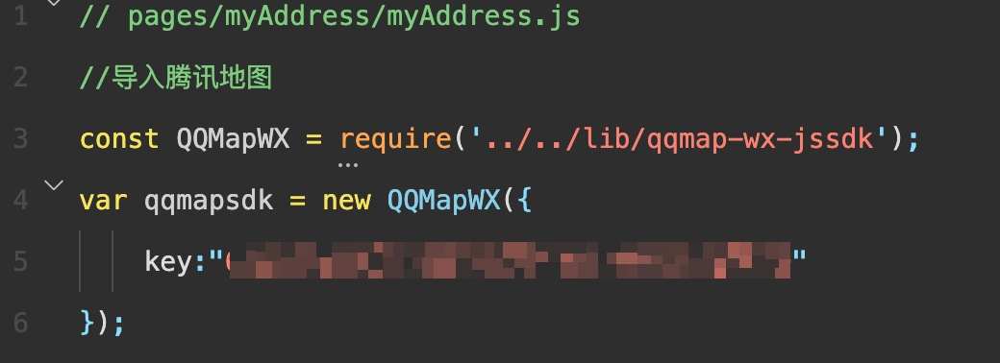

# 项目介绍
微信小程序原生组件开发的 货运/打车 小程序，通过微信云服务（云函数、云数据库）实现后端操作，地图部分使用腾讯地图sdk。
主要前端部分由 [Liu-ar](https://gitee.com/liu-ar)实现
业务逻辑以及部分细化页面由 [Betu-Li](https://github.com/Betu-Li)实现

# 数据库
用户记录 `user`：

订单记录 `order`：

# 项目配置
Clone using the web URL ：`https://github.com/Betu-Li/Yun-Da.git`
## 云环境配置
在项目设置中修改`appid`，在 `app.js` 中修改云函数初始化函数中的 `env` 环境id。环境id可以中微信开发者工具中的开发者控制台出查看。

修改云函数 `mapFunctions` 的 `config.json` 中的 `key`为腾讯地图api key。腾讯地图开发者key申请：[申请密钥](https://lbs.qq.com/dev/console/key/add)

修改腾讯地图key：
`miniprogram/pages/myAddress/myAddress.js` 
`miniprogram/pages/toAddress/toAddress.js`

